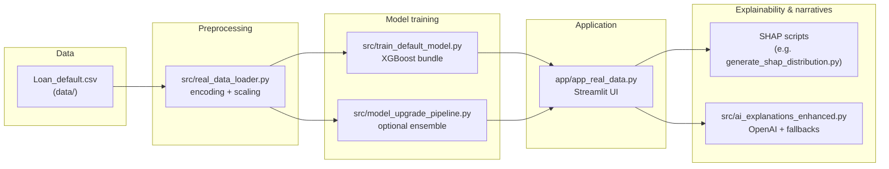

# Clarity in Credit: End-to-End Loan Default Prediction with Explainable AI

**Clarity in Credit** is an educational and research-oriented platform for **retail loan default risk scoring**. It combines a large real-world tabular dataset, gradient-boosted models, optional multi-algorithm training, SHAP-oriented tooling for local explanation workflows, and **optional** large-language-model narratives for multiple stakeholder lenses.

---

## Highlights

| Area | What this project offers |
|------|---------------------------|
| **Real portfolio-scale data** | **~255k** loan applications (`Default` as label, ~11.6% positive class) from `data/Loan_default.csv`—not a toy synthetic set. |
| **Gradient boosting & ensembles** | **Default path:** XGBoost training via `src/train_default_model.py` (artifact: `models/loan_default_model_real.pkl`). **Upgrade path:** `src/model_upgrade_pipeline.py` with **XGBoost, LightGBM, CatBoost**, Random Forest, and stacked / voting-style workflows in `src/advanced_model_training.py`. |
| **Explainability** | **SHAP** (optional dependency) used in `generate_shap_distribution.py` for TreeSHAP-style diagnostics on trained models; the Streamlit app surfaces **risk bands**, **feature-driven rule text**, and model metadata. |
| **Multi-role AI narratives** | With `OPENAI_API_KEY`, `src/ai_explanations_enhanced.py` generates **customer**, **credit-underwriting**, and **compliance-style** reports using the **OpenAI API** (configure **GPT-4 family** or other models via `OPENAI_MODEL`, e.g. `gpt-4o` or `gpt-4o-mini`). **Rule-based fallbacks** run without any API key. |

---

## Architecture (data flow)



---

## Repository layout (logical)

| Path | Role |
|------|------|
| `app/app_real_data.py` | Main Streamlit dashboard (risk assessment, model details, about). |
| `app/app_corrected.py` | Alternate UI variant with corrected-scaling loader where applicable. |
| `src/` | Core logic: data loading, training, upgrade pipeline, AI explanations, `paths.py` for `data/` and `models/`. |
| `data/Loan_default.csv` | Primary dataset (keep out of public forks if sensitive). |
| `models/*.pkl` | Serialized model bundles (loaded by priority in the app—see note below). |
| `run.py` / `Makefile` | One-command **install → train → app** workflows. |
| `.env.example` | Template for `OPENAI_API_KEY` (copy to `.env`). |

**Model load priority in the app:** `loan_default_model_neural_network.pkl` → `loan_default_model_working.pkl` → `loan_default_model_calibrated.pkl` → `loan_default_model_real.pkl`. Remove or rename higher-priority files if you want the freshly trained `*_real` bundle to load.

---

## Requirements

- **Python 3.9+**
- **Dataset:** `data/Loan_default.csv` (or a compatible CSV with the same schema; see `src/real_data_loader.py`).
- **Optional:** OpenAI API key for generative explanations (see `.env.example`).

---

## Quick start (recommended)

### Option A — `run.py` (Windows, macOS, Linux)

```bash
# Full pipeline: install dependencies, train default XGBoost model, start Streamlit
python run.py all

# Faster smoke train (random subset) then app
python run.py all --sample 30000 --port 8505

# Individual steps
python run.py install
python run.py train              # full data (longer)
python run.py train --sample 50000
python run.py app --port 8505
```

### Option B — `Makefile` (Unix-like shells, CI)

```bash
make all                    # install + train + app
TRAIN_SAMPLE=30000 make train   # faster training subset
make app PORT=8505
```

### Windows batch (optional)

- `run_all.bat` — wraps `python run.py all`.
- Other launchers under project root and `scripts/` call `app\app_real_data.py` from the repo root.

Then open the URL shown in the terminal (default **http://localhost:8505**).

---

## Optional: generative explanations

1. Copy `.env.example` to `.env`.
2. Set `OPENAI_API_KEY` to a valid key (`sk-…`).
3. Optionally set `OPENAI_MODEL` (e.g. `gpt-4o`, `gpt-4o-mini`).

Restart the app after changes.

---

## Optional: advanced model upgrade

Heavy pipeline (feature engineering + multiple algorithms):

```bash
python -m src.model_upgrade_pipeline
```

Outputs are written under `models/` per pipeline configuration (see module docstrings).

---

## SHAP diagnostics (optional)

With `shap` installed:

```bash
python generate_shap_distribution.py
```

Uses project path helpers and writes figures under `outputs/` when configured in those scripts.

---

## Disclaimer — privacy, security, and responsible AI

- **Not production lending software.** This repository is for **education, coursework, and research**. No warranty of fitness for credit decisions, compliance with any jurisdiction’s lending or consumer-protection laws, or absence of model error or bias.
- **Data sensitivity:** The dataset is **tabular loan application data** at portfolio scale. If you replace it with real production extracts, treat them as **confidential**; do not commit PII, secrets, or regulated data to public Git remotes.
- **Responsible use:** Automated scores and LLM text are **assistive** only. Institutions must maintain **human oversight**, **model governance** (validation, monitoring, drift, fairness testing appropriate to policy), and **transparent adverse-action** processes where legally required. Users are responsible for how they deploy, prompt, and interpret models.
- **Third-party APIs:** Sending application narratives to cloud LLM providers may have **privacy and data-processing implications**; use enterprise agreements and data-minimization practices if you extend this pattern beyond a local demo.

---

## License / attribution

Developed for **educational and research** purposes. Adapt and cite according to your institution’s policies and any third-party data or library licenses.
