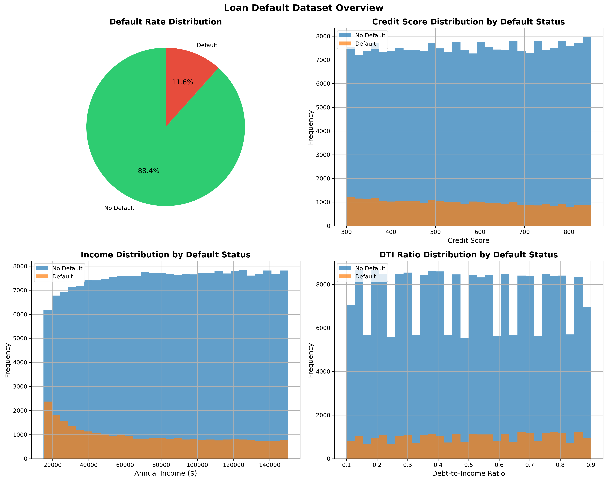
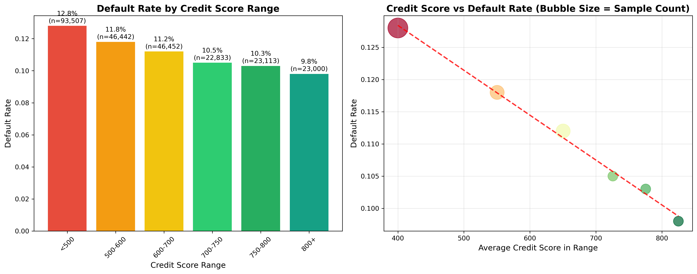
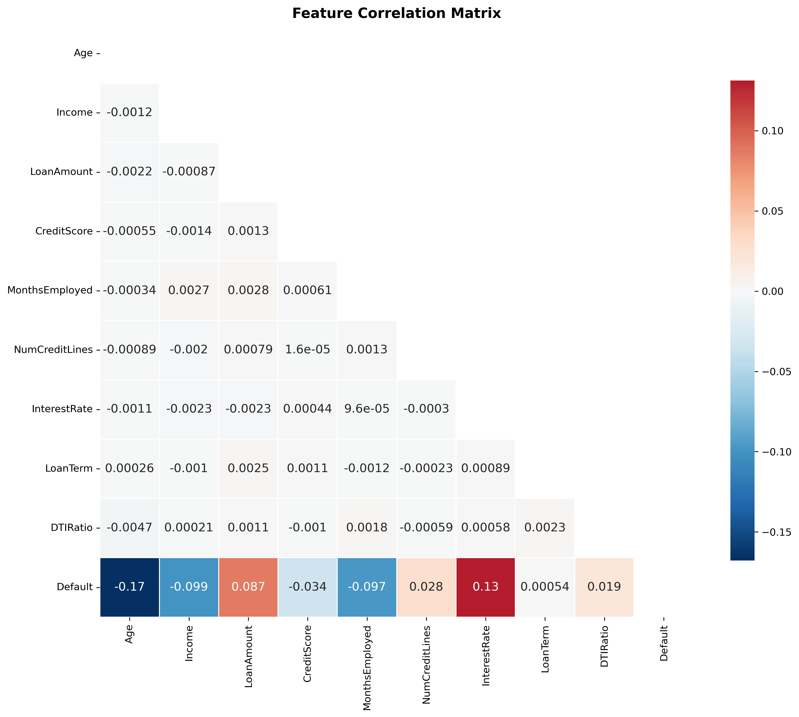

# Explainable Credit Risk Assessment

An end-to-end machine learning project for predicting loan default risk using **XGBoost**, **cost-sensitive decision thresholds**, **SHAP explainability**, and an interactive **Streamlit dashboard**.

The project demonstrates how a credit-risk model can move beyond simple classification by combining model performance, business cost considerations, and human-readable explanations.

---

## Project Overview

The system analyses applicant and loan information and produces:

- A model-generated credit risk score
- A higher-risk / lower-risk classification
- A cost-sensitive decision threshold
- SHAP-based feature explanations
- A plain-language explanation of the main risk drivers
- An interactive Streamlit interface

The dataset contains **255,347 loan records** with borrower, employment, credit, and loan characteristics.

> The model output is presented as a **risk score**, not a calibrated probability of default.

---

## Key Features

- **XGBoost classification model**
- **255k+ loan records**
- Mixed numerical and categorical feature preprocessing
- Class imbalance handling with `scale_pos_weight`
- Stratified Train / Validation / Test split
- F1-based threshold optimisation
- Cost-sensitive threshold optimisation
- Business assumption: false negatives cost **5×** false positives
- SHAP explainability for individual predictions
- Human-readable risk explanations
- Saved model artifacts with Joblib
- Interactive Streamlit dashboard

---

## Model Pipeline

```text
Loan Dataset
     │
     ▼
Data Loading
     │
     ▼
Feature Preprocessing
     │
     ├── Numerical Features
     │      └── StandardScaler
     │
     └── Categorical Features
            └── OneHotEncoder
     │
     ▼
XGBoost Classifier
     │
     ▼
Validation-Based
Threshold Optimisation
     │
     ├── F1 Threshold
     └── Cost-Sensitive Threshold
     │
     ▼
Untouched Test Evaluation
     │
     ▼
Saved Model Artifact
     │
     ▼
Streamlit Application
     │
     ├── Risk Score
     ├── Risk Classification
     ├── SHAP Explanation
     └── Plain-Language Summary
```

---

## Dataset

The dataset contains **255,347 records** and 18 columns.

The target variable is:

```text
Default
0 = Non-default
1 = Default
```

Class distribution:

| Class | Records | Share |
|---|---:|---:|
| Non-default | 225,694 | 88.39% |
| Default | 29,653 | 11.61% |

Because only about **11.6%** of records represent defaults, the dataset is imbalanced. For this reason, model evaluation focuses on metrics such as **Recall, F1, ROC-AUC and PR-AUC**, rather than relying only on accuracy.

### Input Features

Numerical features include:

- Age
- Income
- Loan Amount
- Credit Score
- Months Employed
- Number of Credit Lines
- Interest Rate
- Loan Term
- Debt-to-Income Ratio

Categorical features include:

- Education
- Employment Type
- Marital Status
- Mortgage Status
- Dependents
- Loan Purpose
- Co-Signer Status

`LoanID` is excluded from model training because it is an identifier rather than a predictive feature.

---

## Model Evaluation

The dataset is split into:

| Dataset | Records | Purpose |
|---|---:|---|
| Training | 163,421 | Model training |
| Validation | 40,856 | Threshold selection |
| Test | 51,070 | Final untouched evaluation |

The validation set is used to choose thresholds so the final test set remains independent.

### XGBoost Test Performance

At the default classification threshold of `0.50`:

| Metric | Result |
|---|---:|
| Accuracy | 0.6944 |
| Precision | 0.2288 |
| Recall | 0.6879 |
| F1 Score | 0.3434 |
| ROC-AUC | 0.7585 |
| PR-AUC | 0.3322 |

---

## Threshold Optimisation

A fixed threshold of `0.50` is not necessarily the best decision rule for an imbalanced credit-risk problem.

Two threshold strategies are evaluated.

### F1-Optimised Threshold

The best validation F1 threshold was:

```text
0.6146
```

On the untouched test set:

| Metric | Default 0.50 | F1 Threshold 0.6146 |
|---|---:|---:|
| Accuracy | 0.6944 | 0.7982 |
| Precision | 0.2288 | 0.2910 |
| Recall | 0.6879 | 0.5137 |
| F1 | 0.3434 | 0.3716 |

The optimised threshold improved test F1 while producing a different precision-recall trade-off.

---

## Cost-Sensitive Decision Threshold

For demonstration purposes, the project assumes:

```text
Cost(False Negative) = 5
Cost(False Positive) = 1
```

This represents a scenario where failing to identify a genuine defaulter is considered more costly than incorrectly flagging a non-defaulting applicant.

The validation-derived cost-sensitive threshold was:

```text
0.6105
```

Final test results:

| Metric | Default Threshold | Cost-Sensitive Threshold |
|---|---:|---:|
| Threshold | 0.5000 | 0.6105 |
| Accuracy | 0.6944 | 0.7955 |
| Precision | 0.2288 | 0.2892 |
| Recall | 0.6879 | 0.5220 |
| F1 | 0.3434 | 0.3722 |
| Weighted Cost | 23,009 | 21,786 |

Under this illustrative cost function, weighted test cost decreased by approximately **5.3%**.

> The 5× false-negative cost is a project assumption used to demonstrate cost-sensitive decision making. It should not be interpreted as a universal banking industry value.

---

## Explainable AI with SHAP

The project uses **SHAP** to explain how individual features influence each model prediction.

For a high-risk test applicant, the model identified risk drivers such as:

- Income
- Loan Amount
- Age
- Interest Rate
- Months Employed
- Employment Type

Example explanation:

> The main factors pushing the model toward higher predicted default risk were Income, Loan Amount, Age, Interest Rate and Months Employed.

SHAP explanations describe how variables influence the **model prediction**. They do not establish causal relationships.

---

## Streamlit Dashboard

The Streamlit application allows users to enter applicant information and receive:

- Model risk score
- Decision threshold
- Higher-risk / lower-risk classification
- Top SHAP risk drivers
- Plain-language explanation

Run the application with:

```bash
python -m streamlit run app/app.py
```

On Windows, you can also use:

```text
launch.bat
```

---

## Project Structure

```text
Loan-Default-Prediction-ML/
│
├── app/
│   ├── __init__.py
│   └── app.py
│
├── data/
│   └── Loan_default.csv
│
├── docs/
│   └── images/
│       ├── dataset_overview.png
│       ├── credit_score_analysis.png
│       └── correlation_heatmap.png
│
├── models/
│   └── credit_risk_model.joblib
│
├── src/
│   ├── __init__.py
│   ├── data_loader.py
│   ├── demo_explanation.py
│   ├── explainability.py
│   ├── model_loader.py
│   ├── paths.py
│   ├── preprocessing.py
│   └── train_model.py
│
├── .env.example
├── .gitignore
├── launch.bat
├── Makefile
├── README.md
└── requirements.txt
```

---

## Installation

### 1. Clone the repository

```bash
git clone https://github.com/Allen8001/Loan-Default-Prediction-ML.git
cd Loan-Default-Prediction-ML
```

### 2. Create a virtual environment

Windows PowerShell:

```powershell
python -m venv .venv
.\.venv\Scripts\Activate.ps1
```

macOS / Linux:

```bash
python -m venv .venv
source .venv/bin/activate
```

### 3. Install dependencies

```bash
python -m pip install -r requirements.txt
```

---

## Train the Model

Run:

```bash
python -m src.train_model
```

This will:

1. Load the dataset
2. Split the data into train, validation and test sets
3. Preprocess numerical and categorical features
4. Train the XGBoost model
5. Optimise F1 and cost-sensitive thresholds
6. Evaluate on the untouched test set
7. Save the trained model artifact

The resulting model is saved to:

```text
models/credit_risk_model.joblib
```

---

## Run the Application

```bash
python -m streamlit run app/app.py
```

Then open:

```text
http://localhost:8501
```

---

## Run the SHAP Demo

To generate an explanation for a high-risk test applicant:

```bash
python -m src.demo_explanation
```

---

## Technology Stack

- Python
- Pandas
- NumPy
- Scikit-learn
- XGBoost
- SHAP
- Streamlit
- Joblib

---

## Exploratory Data Analysis

Some exploratory visualisations from the dataset are retained under `docs/images/`.

### Dataset Overview



### Credit Score Analysis



### Correlation Analysis



These visualisations describe the dataset and should not be interpreted as evidence of causal relationships.

---

## Design Decisions

This project intentionally separates model training from application inference.

```text
Training pipeline
    ↓
Saved model artifact
    ↓
Application loads artifact
    ↓
Applicant prediction
    ↓
SHAP explanation
```

This prevents the Streamlit application from retraining the model every time it starts.

The project also separates:

- Data loading
- Preprocessing
- Model training
- Model loading
- Explainability
- User interface

This makes the codebase easier to maintain, test and extend.

---

## Limitations

This project is intended as a machine learning and software engineering portfolio project.

Important limitations include:

- The dataset does not represent a live production lending environment.
- The model risk score has not been probability-calibrated.
- The 5× false-negative cost assumption is illustrative.
- SHAP explains model behaviour, not causal relationships.
- Real-world credit decisions require additional governance, validation, fairness assessment, compliance and human oversight.

---

## Future Improvements

Potential extensions include:

- Probability calibration
- Additional model comparison and hyperparameter optimisation
- Fairness and bias evaluation
- Automated model tests
- CI/CD pipeline
- Docker containerisation
- Cloud deployment
- Model monitoring
- Drift detection
- Expanded dashboard visualisations